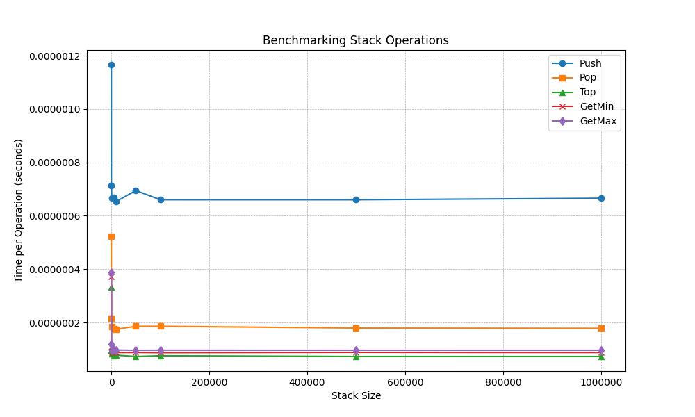

# IEEE Round 2 Submission – Custom Data Structure Implementation

# Level 1

## 📌 Project Overview


This project implements a **Stack** data structure that supports the following operations in **O(1) time complexity** and **O(n) space complexity**:

- `push(x)`: Pushes element `x` onto the stack.
- `pop()`: Removes the top element from the stack.
- `top()`: Returns the top element without removing it.
- `getMin()`: Returns the smallest element in the stack.
- `getMax()`: Returns the largest element in the stack.

## **🚀 Technologies Used**

- **Language**: Python (>=3.13)
- **Development Tools**: Poetry, Pre-commit, MyPy, Ruff, Pytest
- **Version Control**: Git

## **🌟 Features Implemented**

✔️ Custom Stack implementation supporting all operations in **O(1) time** and **O(n) space**

✔️ Efficient tracking of **minimum** and **maximum** values using auxiliary double-ended queue

✔️ Unit tests using **Pytest**

✔️ Pre-commit hooks for linting & formatting

## **🛠️ Setup Instructions**

### **Prerequisites**

- Python **>=3.13+**
- Poetry package manager

### **Installation Steps**

1. Install [Python](https://www.python.org/) and [Poetry](https://python-poetry.org/)
2. Run the following commands:

```bash
# Clone the repository
git clone https://github.com/your-username/ieee-submission.git
cd ieee-submission

# Install dependencies
poetry install

# Activate virtual environment
eval $(poetry env activate)
```

### Usage

```bash
poetry run python -m ieee_submission

```

### **Running Tests**

```bash
pytest
```

## **📊 Implementation Details**

### **Data Structures Used**

- **Main Stack (`stack`)**: Stores the actual elements using a list
- **Auxiliary Deck (`aux`)**: Stores the min and max elements on the extreme left and right side of the deque respectively

### Algorithm

- `push`: Append the element to the end of the `stack`. Update the auxiliary deque:

  - If `x` is smaller than the current minimum, push it to the front.
  - If `x` is larger than the current maximum, push it to the back.
  - If `x` equals the current min/max, increment their respective counts.

- `pop`: Remove the element from the top of the `stack`. Update the auxiliary deque:

  - If the popped element was the min/max, decrement its count.
  - If the count reaches zero, remove it from the deque.

- `top`: Return the last element in `stack` without modifying it.

- `getMin`: Return the first element of `aux`, which represents the current minimum.

- `getMax`: Return the last element of `aux`, which represents the current maximum.

#### Example

Suppose the stack entered is this (pushed from left to right): 9 8 6 9 10

Step-by-step tracking:

1. **Push 9**

   - Stack: `[9]`
   - Aux: `[(9,1)]` (Min: 9, Max: 9)

2. **Push 8**

   - Stack: `[9, 8]`
   - Aux: `[(8,1), (9,1)]` (Min: 8, Max: 9)

3. **Push 6**

   - Stack: `[9, 8, 6]`
   - Aux: `[(6,1), (8,1), (9,1)]` (Min: 6, Max: 9)

4. **Push 9**

   - Stack: `[9, 8, 6, 9]`
   - Aux: `[(6,1), (8,1), (9,2)]` (Min: 6, Max: 9)

5. **Push 10**
   - Stack: `[9, 8, 6, 9, 10]`
   - Aux: `[(6,1), (8,1), (9,2), (10,1)]` (Min: 6, Max: 10)

#### Operations

- `top() -> 10`
- `getMin() -> 6`
- `getMax() -> 10`

**Pop Operations:**

- `pop() -> 10`

  - Stack: `[9, 8, 6, 9]`
  - Aux: `[(6,1), (8,1), (9,2)]` (Min: 6, Max: 9)

- `pop() -> 9`

  - Stack: `[9, 8, 6]`
  - Aux: `[(6,1), (8,1), (9,1)]` (Min: 6, Max: 9)

- `pop() -> 6`

  - Stack: `[9, 8]`
  - Aux: `[(8,1), (9,1)]` (Min: 8, Max: 9)

- `pop() -> 8`
  - Stack: `[9]`
  - Aux: `[(9,1)]` (Min: 9, Max: 9)

This ensures that all operations, including `getMin()` and `getMax()`, run in **O(1)** time complexity.

### **Operations Complexity**

| Operation  | Time Complexity | Space Complexity |
| ---------- | --------------- | ---------------- |
| `push(x)`  | **O(1)**        | **O(n)**         |
| `pop()`    | **O(1)**        | **O(1)**         |
| `top()`    | **O(1)**        | **O(1)**         |
| `getMin()` | **O(1)**        | **O(1)**         |
| `getMax()` | **O(1)**        | **O(1)**         |

### **Benchmarks**



#### **Possible Reasons for the Spike:**

1. **Cold Start Effects:**

   - When the stack is small, Python’s memory allocator may need to allocate new memory pages for the list and deque structures.
   - The first few operations (especially `push`) might trigger additional memory allocations and initialization overhead.

2. **Python's Dynamic List Growth:**
   - The list backing the stack may need to grow dynamically, and for small sizes, Python's `list` resizing can cause fluctuations in execution time.
   - Once the list reaches a stable resizing pattern, the execution time becomes more consistent.

#### **Why Does It Stabilize?**

- Once the stack reaches a sufficiently large size, memory allocation and dynamic resizing effects stabilize.
- Operations stabilize into their **O(1) time complexity** pattern, showing near-constant time performance.

## **🛠️ Code Quality**

- Uses **Pre-commit hooks** for linting (`ruff`), static type checking (`mypy`), and code formatting
